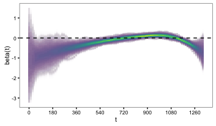
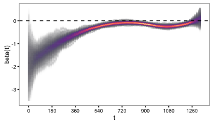

# VizUncertainty

A function for visualizing results uncertainty. The function draws from a user-supplied posterior distribution p(θ|y), generally in the form of two vectors: (1) mean estimates and (2) error estimates. The draws are then graphed with visual weighting so that areas of the posterior with concentrated uncertainty are emphasized, whereas areas with diffuse uncertainty are less prominent.

The code is adapted from [Felix Schönbrodt](http://www.nicebread.de/visually-weighted-watercolor-plots-new-variants-please-vote/) and is motivated by Solomon Hsiang's [paper](http://papers.ssrn.com/sol3/papers.cfm?abstract_id=2265501).

## Examples

